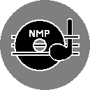
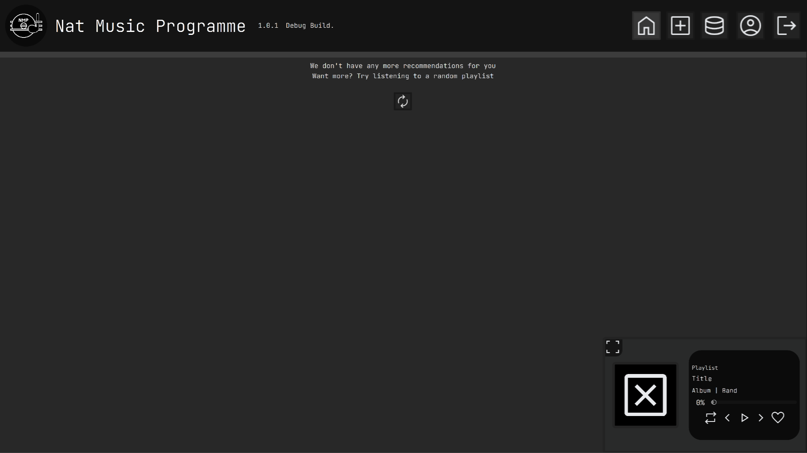
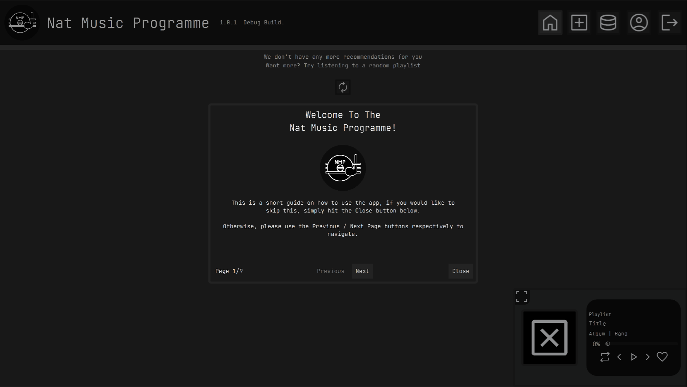
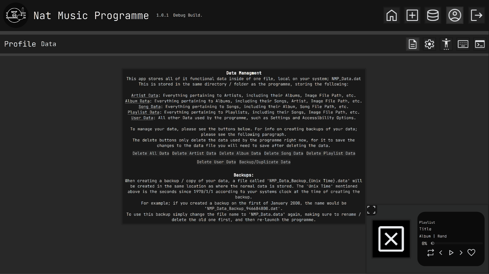
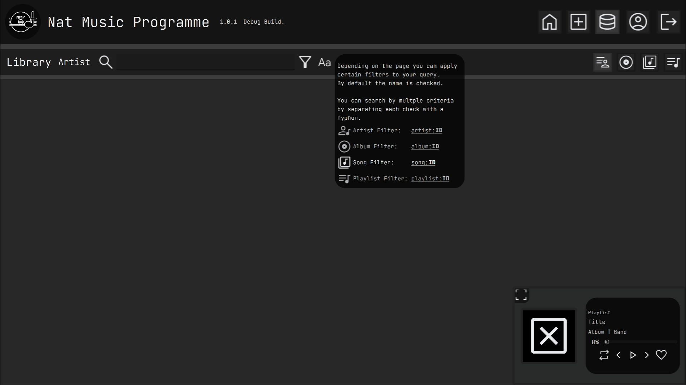
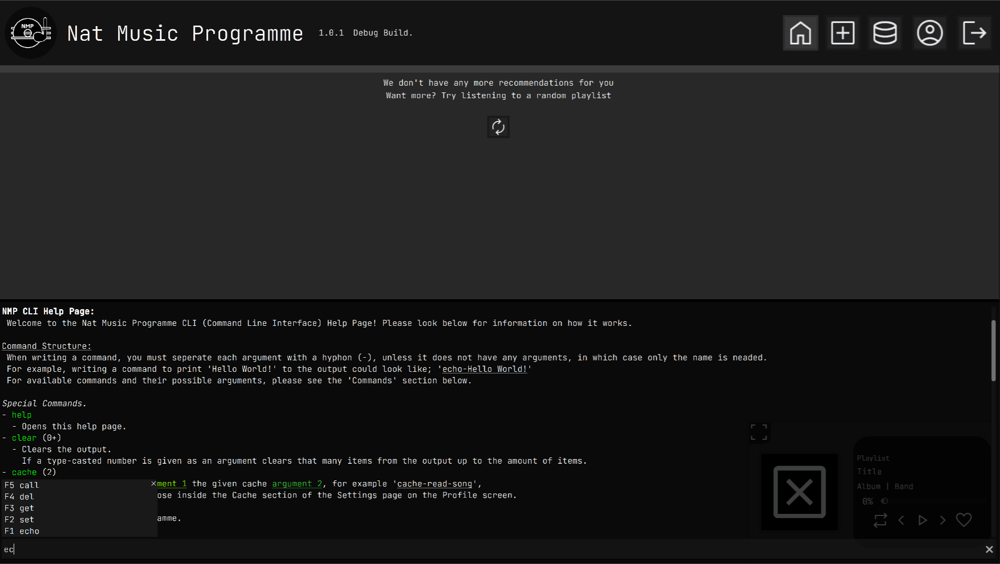

# Nat Music Programme #

> [!Note]
> If you just want to use the app, please see the 'Releases' tab on the right for stable builds, for more information see below.

The NMP (Nat Music Programme) is an app made in Godot (4.4) which allows you to upload and listen to songs (.mp3, .ogg and .wav), you can sort them by Artist and Album, and also create and manage Playlists.  
You can also use the built-in CLI (Command Line Interface) to get more granular control and specific information.  
There is an Accessibility page located in the Profile screen.
The app is entirely offline and standalone.

## Scalability / ID's ##

This project has been made with scalability in mind; As such many efforts have been made to ensure that the app doesn't limit your ability to listen to and organise music, including the ID system for every item.  
Each either Artist, Album, Song or Playlist uses a unique ID to identify itself, which is 17 characters long. The first character is a number ranged 0-3 which signs / indicates the type of the ID, and the other 16 are picked from a list of 100 characters, giving each data type 16**100 unique items available.  

Other efforts have been made to make the app able to handle itself despite the way you want to use it, including:  
- Giving a multitude of functions to the CLI to help make your management of the app and its data easier.
- Adjustable keybinds for every shortcut / hotkey in the app.
- Songs and Albums can be listened to stand-alone if you don't want to upload / create Albums and Artists for them.

## Project Details ##

This is made entirely using Godot 4.4, with GDScript (all statically-typed) as the language. The project is organized into the following folders:
- addons:
  - ExportDataSetter: Addon folder for the export plugin used to set the build date for any exported builds.
  - NatCustomExporter: From [Nat Custom Exporter Github](https://github.com/NatZombieGames/Nat-Custom-Exporter--Godot-), used to keep integrity of .svg files when exporting the project.
- Assets:
  - Fonts: The main font used by the app (JetBrains Mono Light (Light)), and any future fonts.
  - Icons: All the icons (.svg) used by the app, when the app is launched these are all read and imported into a dictionary with their names as the keys
  - Styleboxes: All the styleboxes used.
  - ButtonGroups: All the button groups used.
  - Tutorial Images: The unique images used during the tutorial.
  - Everything else is misc. assets including the AudioBusLayout and Icon / Logo.
- Exported, All of the builds for the app, the names are structured; 'NatMusicProgramme_{architecture}', for example the main 64Bit builds for both versions are called 'NatMusicProgramme_x64':
  - Windows: Folder containing all the Windows builds.
    - Other Builds: Folder where all other Windows builds are exported to.
    - Where the main build for Windows is exported, being 64Bit.
  - Linux: Folder containing all the Linux builds
    - Other Builds: Folder with all other Linux builds are exported to.
    - Where the main build for Linux is exported, being 64Bit.
- Scenes:
  - All the scene files.
- Scripts:
  - Globals: All the global/manager scripts
  - All other script files.

## Data Management ##

When launched the app will check for 'NMP_Data.dat' in the same directory for all of its information, including Artist, Album, Song, Playlist and User data, this is also where data will be saved.   
Only the directory the app is located in will be checked, so moving the app will require the data file to be moved to continue using said data. You can create backups of your data inside the app which will be named 'NMP_Data_{unix_time_according_to_system}.dat' and saved in the same directory as where the app is.  

The data is saved using Godot's ConfigFile class, the data is organised like:  

- data: Topmost section everything is in.
  - artist_id_dict: The Artist dictionary, where all the artist data is.
  - album_id_dict: The Album dictionary, where all the album data is.
  - song_id_dict: The Song dictionary, where all the song data is.
  - playlist_id_dict: The Playlist dictionary, where all the playlist data is.
  - user_id_dict: The User dictionary, where all the user data like settings and certain app info is.

## Showcase Images ##

